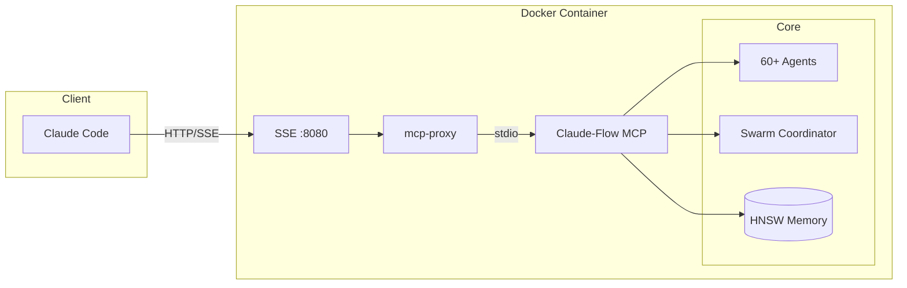
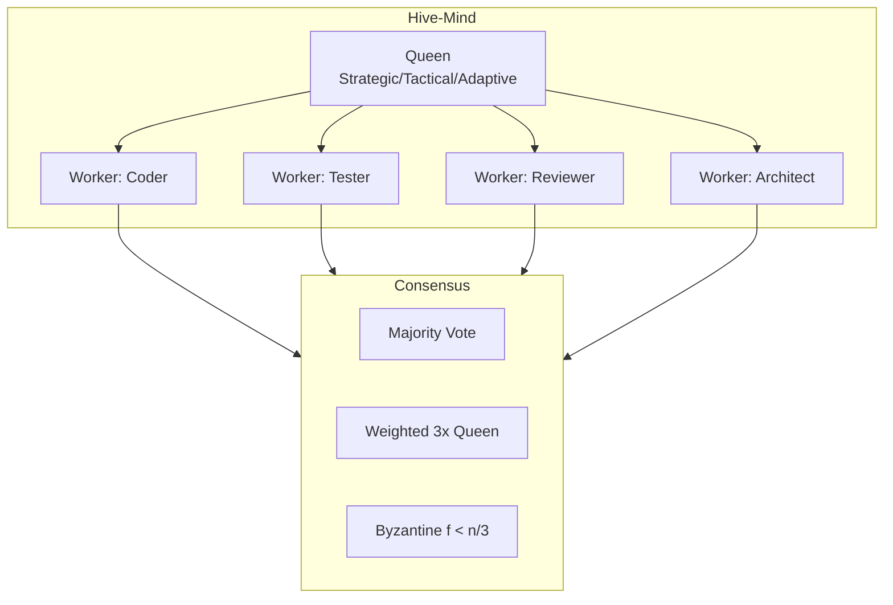

# Claude-Flow Docker

[](https://hub.docker.com/r/sauronx2/claude-flow)
[](https://github.com/sauronx2/claude-flow-docker/actions)
[](https://github.com/ruvnet/claude-flow)
[](LICENSE)

**One command to run [Claude-Flow v3](https://github.com/ruvnet/claude-flow) — the enterprise AI orchestration platform with 60+ agents, swarm coordination, and self-learning capabilities.**

```bash
docker run -d -p 8080:8080 sauronx2/claude-flow
```

---

## What is Claude-Flow?

[Claude-Flow](https://github.com/ruvnet/claude-flow) is a production-ready multi-agent AI orchestration framework that transforms Claude Code into a powerful development platform.

### Architecture



### Key Capabilities

| Category | Features |
|----------|----------|
| **Agents** | 60+ specialized: coder, tester, reviewer, architect, security, DevOps |
| **Swarm** | 4 topologies (mesh, hierarchical, ring, star) + 5 consensus protocols |
| **Hive-Mind** | Queen-Worker hierarchy with strategic/tactical/adaptive queens |
| **Memory** | HNSW vector search (150x-12,500x faster), SQLite persistence |
| **Learning** | SONA self-optimization (<0.05ms), EWC++ prevents forgetting |
| **Multi-LLM** | Claude, GPT, Gemini, Ollama with automatic failover |
| **Tools** | 175+ MCP tools for orchestration, memory, GitHub, monitoring |

---

## Why Docker?

Claude-Flow requires Node.js 20+, native dependencies (better-sqlite3), and initialization. This project provides:

| Feature | Description |
|---------|-------------|
| **Zero Setup** | `docker run` and it works |
| **Auto-Update** | Checks npm registry on every start, updates to latest alpha |
| **Colored Logs** | Key events only (INFO/OK/WARN/ERROR) for lazydocker |
| **CI/CD** | GitHub Actions auto-publishes to Docker Hub on every commit |
| **Persistence** | Docker volumes preserve agents, memory, learned patterns |
| **SSE Bridge** | mcp-proxy converts stdio → SSE for Claude Code connection |

---

## Quick Start

### 1. Run

```bash
# Minimal
docker run -d --name claude-flow -p 8080:8080 sauronx2/claude-flow:latest

# With persistence (recommended)
docker run -d --name claude-flow -p 8080:8080 \
  -v claude-flow-db:/root/.claude-flow \
  sauronx2/claude-flow:latest
```

**Or with Docker Compose:**

```bash
curl -sO https://raw.githubusercontent.com/sauronx2/claude-flow-docker/main/docker-compose.hub.yml
docker compose -f docker-compose.hub.yml up -d
```

### 2. Connect Claude Code

```bash
claude mcp add --transport sse claude-flow http://localhost:8080/sse
```

### 3. Use

```bash
claude
```

Now you have access to 175+ tools:

```
agent_spawn, swarm_init, hive-mind_spawn, memory_store, memory_search,
task_create, hooks_route, hooks_intelligence, neural_train, and more...
```

---

## Claude-Flow v3 Features

### 60+ Specialized Agents

| Category | Agents |
|----------|--------|
| **Core** | coder, reviewer, tester, planner, researcher |
| **V3 Specialized** | queen-coordinator, security-architect, memory-specialist |
| **Swarm** | hierarchical/mesh/adaptive coordinators |
| **Consensus** | Byzantine, Raft, Gossip managers |
| **GitHub** | PR management, code review, issue tracking |
| **DevOps** | CI/CD, deployment, monitoring agents |

### Swarm Coordination



**Topologies:** Hierarchical • Mesh • Ring • Star • Hybrid

**Consensus:** Raft • Byzantine • Gossip • CRDT • Majority

### Intelligent Routing

| Tier | Handler | Latency | Use Case |
|------|---------|---------|----------|
| 1 | Agent Booster (WASM) | <1ms | var→const, add-types, remove-console |
| 2 | Haiku/Sonnet | ~500ms | Bug fixes, refactoring |
| 3 | Opus + Swarm | 2-5s | Architecture, security design |

### Memory & Learning

| Component | Performance |
|-----------|-------------|
| **HNSW Search** | ~61µs/query, 16,400 QPS |
| **SONA Adaptation** | <0.05ms |
| **LoRA Compression** | 128x, <3µs, 383k ops/s |
| **Token Reduction** | 30-50% via ReasoningBank |

---

## Container Logs

```
2026-02-11T13:13:57Z [INFO] ========== Claude-Flow Container Starting ==========
2026-02-11T13:13:58Z [INFO] Current version: 3.1.0-alpha.28
2026-02-11T13:13:58Z [INFO] Checking for updates...
2026-02-11T13:13:59Z [OK] Already on latest version: 3.1.0-alpha.28
2026-02-11T13:14:01Z [OK] Memory initialized
2026-02-11T13:14:01Z [OK] ========== Starting MCP Server on port 8080 ==========
```

When a new version is available:

```
2026-02-12T10:00:01Z [INFO] New version available: 3.1.0-alpha.29
2026-02-12T10:00:01Z [INFO] Updating claude-flow...
2026-02-12T10:00:15Z [OK] Updated to version 3.1.0-alpha.29
```

---

## Local Development

```bash
git clone https://github.com/sauronx2/claude-flow-docker.git
cd claude-flow-docker

make build   # Build image
make start   # Start container
make logs    # View logs
make shell   # Enter container
make stop    # Stop container
make clean   # Remove everything (including data!)
```

---

## Technical Details

| Parameter | Value |
|-----------|-------|
| **Base Image** | `node:22-slim` |
| **Port** | `8080` (SSE) |
| **Volumes** | `claude-flow-db` (memory, patterns), `node-modules-cache` |
| **Restart Policy** | `unless-stopped` |
| **Health Check** | Auto-update on start |

### Files

```
├── Dockerfile              # Multi-stage build with native deps
├── entrypoint.sh           # Auto-update + logging script
├── docker-compose.yml      # Local build
├── docker-compose.hub.yml  # Pre-built image from Docker Hub
├── Makefile                # Development commands
└── .github/workflows/      # CI/CD pipeline
```

---

## Links

| Resource | URL |
|----------|-----|
| **Claude-Flow** | https://github.com/ruvnet/claude-flow |
| **Docker Hub** | https://hub.docker.com/r/sauronx2/claude-flow |
| **This Repo** | https://github.com/sauronx2/claude-flow-docker |

---

## License

MIT
